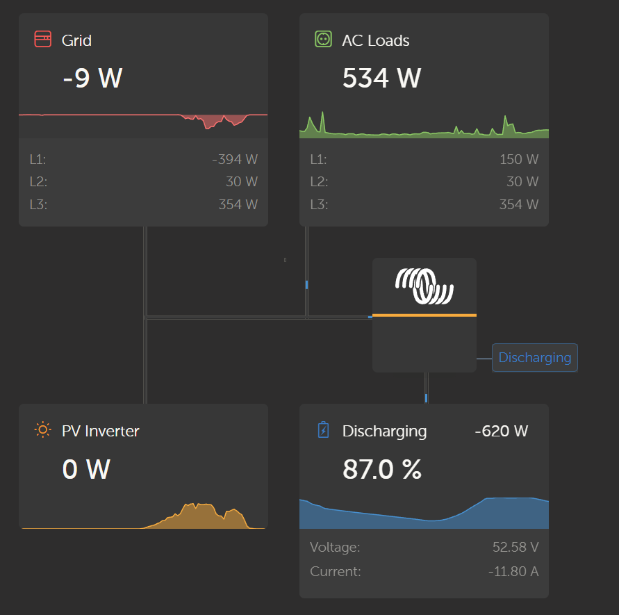

On my house I have a photovoltaics solar system.

To use more of the generated energy myself (I get a reimburstment of about 11 cents per kWh but have to pay ~33 cents per kWh that I consume from the public grid) I built my own LiFePo4 battery with just beneath 8 kWh of storage. The battery inverter is a nice Multiplus II from Victron. Victron also provides a really nice website that shows the current consumption and some other stats.

The problem is: I have 2 grid connected PV inverters from my grid connected PV system (I have 3 arrays, 2 connected to one inverter and a third array that is connected to a second grid tied inverter). But the Multiplus cannot see those 2 inverters. As the Multiplus has a grid meter it gets quite confused where the energy is coming from, when there is current flow from the battery. And of course every calculation (e.g. daily consumption) is way off.

As Victron release the software of its Multiplus inverter as open source on Github, I could see that they can adress Fronius inverters. The problem is of course that my inverters are not Fronius inverters but from Kostal. Also, they do not talk any current standard that the Multiplus is capable of. 

To adress this problem, I created a "middleware" in DotNet that is recognized by the Multiplus as a Fronius inverter. To make it simple I recreated the Web API of a Fronius inverter. When my API is called, it reports itself as a single PV inverter. As soon as the Multiplus recognizes the inverter (my API), it periodically calls the API to get the new values (e.g. PV voltage, current, power, etc.). Whenever my API is called it reaches out to both Kostal inverters and combines the values it receives. Then it reports them back to the Multiplus.

In the future I want to make it more stable and a bit more efficient. But it runs quite stable as a docker container on a proxmox server in my home lab.

If you want to check it out please visit the [repository](https://github.com/sjoachimsthaler/Fronius_Api_Stub).
