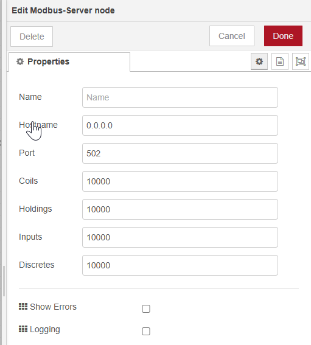
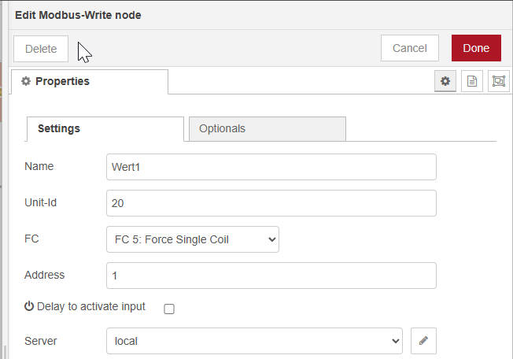

+++
title = "Werte von Homeassistant zur Technischen Alternative CMI übermitteln"
date = "2024-05-29T23:50:58+02:00"
author = "Stefan Joachimsthaler"
authorTwitter = "" #do not include @
cover = ""
tags = ["Homeassistant", "Technische Alternative"]
keywords = ["", ""]
description = ""
showFullContent = false
readingTime = false
+++

## Warum muss ich überhaupt Werte zur CMI übermitteln?

Die Steuerungen von der Technischen Alternative erlauben eine komplette Heizungssteuerung und das auch sehr robust. Aber die Module die TA anbietet sind natürlich im Vergleich mit den Möglichkeiten einer kompletten Hausautomation bzw. einer echten Programmiersprache unterlegen (dafür wesentlich einfacher zu bedienen). Jetzt stellt sich aber die Frage, wie man z.B. der Steuerung von CMI sagt, dass es gerade erlaubt ist die Heizung anzuschalten, weil diese eine Wärmepumpe ist und der dynamische Stromtarif gerade sehr günstig ist.

Ich habe es so gelöst, dass ich der CMI über Modbus eine Freigabe erteile, wann sie die Wärmepumpe anwerfen darf.

## Voraussetzungen
- Erstmal benötigt man natürlich entsprechende Hardware von TA. Mindestens das CMI, wobei das für sich alleine natürlich nicht viel machen kann, also noch mindestens einen Regler dazu.
- Eine Homeassistant-Instanz (bei mir auf einem kleinen Mini-PC, der Homeassistant über Proxmox bereitstellt)
- NodeRed auf der Homeassistant-Instanz installiert.

## Werte in NodeRed bereitstellen

Zunächst muss ein Modbus Server konfiguriert werden. 

Als Demo wird hier zunächst einfach einmal eine 1 und einmal eine 0 an ein Register gesendet. Das passiert mit eienr "Modbus-Write" Node. Hier versuche ich immer die "Unit-Id" thematisch zu wählen. Also z.B. Unit-Id 1 ist ein Wechselrichter, Unit-Id2 ist eine Wärmepumpe, etc.

Der Wert den wir nun Injecten wird entsprechend interpretiert (1 = true und 0 = false). Diese Werte stehen dann in dem lokalen Modbus-Server und können somit mit der IP-Adresse des Homeassistant-Servers abgefragt werden.

## Konfiguration Wert Einlesen CMI
Um die Werte nun mit der CMI abfragen zu können müssen wir erstmal in das CMI Webinterface gehen und dort aus "Settings" -> "Inputs".

Hier können wir unter "Modbus" -> "DIGITAL" jetzt unseren Wert auslesen. 

## Konfiguration Wert bereitstellen CMI

Wollen wir den Wert jetzt nicht nur auf der CMI verwenden, wo er uns eigentlich keinerlei Mehrwert bietet, müssen wir den Input jetzt noch im CAN-Netzwerk zur Verfügung stellen. Hierzu müssen wir einen "Output" mit dem eingelesenen Wert erstellen. Auch das ist extrem einfach:

Wir erstellen einfach in den "Outputs" -> "CAN bus" -> "DIGITAL" einen entsprechenden neuen Wert, der den Input aus unserem Modbus Eingang übernimmt. Dann kann von jedem beliebigen Regler auf den Wert der CMI über das CAN Netzwerk zugegriffen werden.
